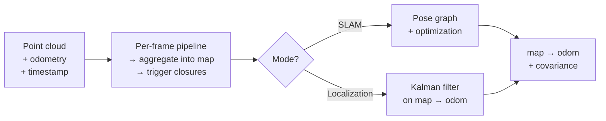

# Vegvisir Architecture

A high-level overview of how Vegvisir is put together.

## What it is

Vegvisir is a SLAM and localization layer for 3D LiDAR or 4D imaging RADAR.
It expects an **external odometry estimate** with every frame — the engine
itself does mapping, loop closure and global localization on top of whatever
odometry the integrator provides.

It runs in one of two modes, selected at construction:

- **SLAM** — build a map incrementally, detect loop closures, optimize a
  keypose graph.
- **Localization** — load a prebuilt map, query closures against it, refine
  the `map → odom` transform with a Kalman filter. The map is read-only.

## Inputs and outputs

Per frame, the integrator pushes a point cloud, an external odometry pose,
and a timestamp. Vegvisir returns a `map → odom` transform with a covariance.
A SLAM run additionally writes a saved map directory on shutdown; a
Localization run reads that directory at startup.

## The big picture

Every frame goes through the same scaffold. The backend differs only in what
it does with closures: SLAM adds a factor and re-optimizes; Localization
folds it into a Kalman update. The expensive part — closure detection — runs
on a background thread, so pose output is never blocked by it.

## Per-frame pipeline

The map is a chain of **keyposes**, each anchoring a **segment** — a local
point cloud around that keypose. New frames extend the current segment;
travelled distance triggers the next keypose.

### Map aggregation

Before the backend sees a frame, the scaffold folds it into the current
segment. A segment closes once the platform has travelled a configured
splitting distance, at which point a new keypose is anchored.

1. Voxel-downsample the incoming point cloud.
2. Integrate the downsampled points into the rolling voxel map.
3. Append the relative pose to the current segment's trajectory.
4. On reaching the splitting distance, finalize the segment and seed a new
   one at the latest pose.
5. Add the new keypose and an odometry factor to the pose graph.

Points are stored in the keypose's local frame, so closures and graph
optimizations only rewrite keyposes — not the points themselves.

### Loop closure detection

Closures match the current segment against stored keyposes:

1. Visual and line-feature matching against the map.
2. Geometric fit, refined to a 6-DoF pose.
3. Validation by overlap with the stored point cloud.

A validated closure becomes a pose-graph factor (SLAM) or a Kalman
measurement (Localization).

## How the two modes differ

Both modes share the same map representation and the same closure detection
pipeline. They diverge in what they do with closures:

| | SLAM | Localization |
|---|---|---|
| Map | Grows incrementally | Loaded read-only |
| Trajectory | Full history | Ring buffer of recent segments |
| Pose estimation | Direct from odometry + keypose chain | Kalman filter on `map → odom` |
| Closure result | New factor in pose graph → re-optimize | Measurement update to Kalman filter |
| Query cadence | Every segment split | Every segment split (separately tuned) |

## Concurrency

The main pipeline is single-threaded; closure detection runs on a background
thread. New closure queries are dropped if the previous one is still running,
so an expensive closure never delays a pose output.

## Map lifecycle

A SLAM run produces a saved map directory; a Localization run consumes it.
The directory contains:

- `metadata.yaml` — name, location, GNSS anchor (ties the map to a global
  geodetic frame).
- `keyposes.tum` — one row per keypose in TUM format.
- `points.ply` — per-segment point clouds, tagged with keypose id.
- `map_closures.db` — closure-detection state (density maps, features) so
  closures can be queried against a loaded map without rebuilding it.
